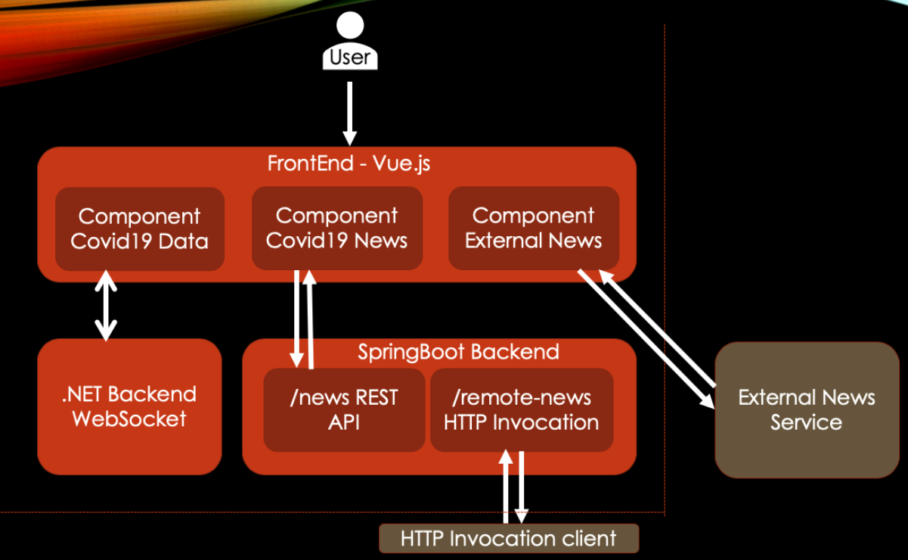
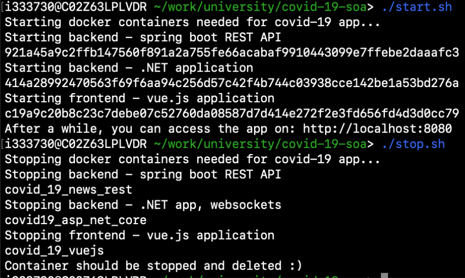

# Information System Documentation
This repo contains automation and documentation for starting the university SOA project.  
Below you can find the architecture of the whole application

## Prerequisites
[Docker](https://www.docker.com/)  
All of the different part are bundled inside docker containers to allow portability and be independent of the OS and tools installed.

## Start the service
execute `start.sh`

## Stopping the service
execute `stop.sh`

### Example

## The result
The service is served by default on http://localhost:8080

